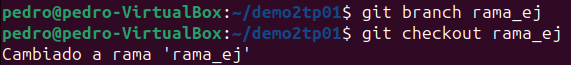

# TP 1 - Git Básico
Este trabajo práctico corresponde a la unidad Nº: 1

#### Objetivos de Aprendizaje
 - [x] Utilizar herramientas de control de configuración de software
 - [x] Familiarizarse con los comandos más utilizados
 - [x] Configurar el repositorio principal de cada alumno para la materia

#### Consignas a desarrollar en el trabajo práctico:
  - Los ejercicios representan casos concretos y rutinarios en uso de este tipo de herramientas
  - En los puntos donde corresponda, proveer los comandos de git necesarios para llevar a cabo el punto.
  - Cuando se especifique alguna descripción, realizarlo de la manera más clara posible y con ejemplos cuando sea necesario.

## Desarrollo:

### 1- Instalar Git ✅

### 2- Crear un repositorio local y agregar archivos 
  - Crear un repositorio local en un nuevo directorio. Agregar un archivo Readme.md, agregar algunas líneas con texto a dicho archivo. Crear un commit y proveer un mensaje descriptivo.

   

### 3- Configuración del Editor Predeterminado ✅
En mi caso, utilice un editor llamado nano que puedo abrir simplemente con el comando con dicho nombre sumado al nombre del archivo desde la misma terminal de Ubuntu.

### 4- Creación de Repos 01 -> Crearlo en GitHub, clonarlo localmente y subir cambios
  - [x] Crear una cuenta en https://github.com
  - Crear un nuevo repositorio en dicha página con el Readme.md por defecto

     
  - Clonar el repo remoto en un nuevo directorio local
    
     
      
     
  - Editar archivo Readme.md agregando algunas lineas de texto
    
     
  - Editar (o crear si no existe) el archivo .gitignore agregando los archivos *.bak
    
    
      
      
  - Crear un commit y proveer un mensaje descriptivo, Intentar un push al repo remoto
    
      
  - [x] En caso de ser necesario configurar las claves SSH requeridas y reintentar el push.

### 5- Creación de Repos 02-> Crearlo localmente y subirlo a GitHub
  - Crear un repo local

     
  - Agregar archivo Readme.md con algunas lineas de texto

     

     
  - Crear archivo .gitignore
    
    
  - Crear un commit y proveer un mensaje descriptivo
  
    
  - Crear repo remoto en GitHub

     
  - Asociar repo local con remoto, Subir cambios.

    
  - **Vista del Repo en Git**

       
  

### 6- Ramas
  - Crear una nueva rama, Cambiarse a esa rama

    
  - Hacer un cambio en el archivo Readme.md6b

    
  - Hacer commit y revisar la diferencia entre ramas

    

### 7- Merges
  - Hacer un merge FF

    

  Como no hay commits en el main desde que cree la nueva rama, este será un merge Fast-Forward.  
  - Borrar la rama creada, Ver el log de commits
 
     
  - Repetir el ejercicio 6 para poder hacer un merge con No-FF

    

    
  - **Log de los commits y el merge**

    

### 8- Resolución de Conflictos
  - Instalar alguna herramienta de comparación. Idealmente una 3-Way:
    
    Me instalé esta llamada Meld

    
  - Crear una nueva rama conflictBranch, Realizar una modificación en la linea 1 del Readme.md desde main y commitear

    
  - En la conflictBranch modificar la misma línea del Readme.md y commitear

    
  - Ver las diferencias con git difftool main conflictBranch

    
  - Cambiarse a la rama main e intentar mergear con la rama conflictBranch

    
  - Resolver el conflicto con git mergetool

    

    

    
  - Agregar .orig al .gitignore

    
  - Hacer commit y push

    
  -**Vista Final del Repo de Git**

    

### 9- Familiarizarse con el concepto de Pull Request

  - Explicar que es un pull request.
  **Definición de Chat GPT:**
  Un Pull Request (PR) es una función en sistemas de control de versiones como GitHub que permite a los desarrolladores notificar a otros miembros del equipo que han completado un cambio en su rama y que les gustaría que ese cambio se integrara en la rama principal (como main o master).
  - Crear un branch local y agregar cambios a dicho branch.
   
     
  - Subir el cambio a dicho branch y crear un pull request.

     

     
  - Completar el proceso de revisión en github y mergear el PR al branch master.

     

    
    
      

### 10- Algunos ejercicios online
  - [x] Entrar a la página https://learngitbranching.js.org/
  - Completar los ejercicios **Introduction Sequence**

      
  

### 11- Crear Repositorio de la materia
  - [x] Crear un repositorio para la materia en github. 
  Lo llamé **IngSoftIII**
  - [x] Subir archivo(s) .md con los resultados e imágenes de este trabajo práctico. 
  Se encuentran en una subcarpeta **TP1-GitBasico**
