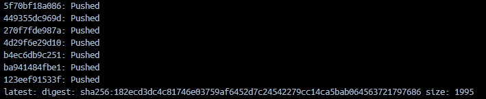
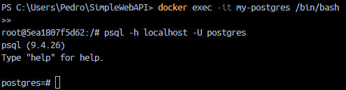

## TP 2 - Introducción a Docker
Este trabajo práctico corresponde a la unidad Nº: 2 (Libro Ingeniería de Software: Unidad 18)

#### Objetivos de Aprendizaje
 - [x] Familiarizarse con la tecnología de contendores 
 - [x] Ejercitar comandos básicos de Docker.

#### Consignas a desarrollar en el trabajo práctico:

- A continuación, se presentarán algunos conceptos generales de la tecnología de contenedores a manera de introducción al tema desde el punto de vista práctico.

## Desarrollo:

### 1- Instalar Docker Community Edition 
  - Elegí la opción para mi sistema operativo Windows 10.
  - https://docs.docker.com/
  - Ejecutar el comando `docker version` para comprobar versiones de cliente y demonio.
  
   


### 2- Explorar DockerHub
   - [x] Registrase en docker hub: https://hub.docker.com/
   - [x] Familiarizarse con el portal


### 3- Obtener la imagen BusyBox
  - Ejecutar el comando `docker pull busybox`, para bajar una imagen de DockerHub

   

  - Verificar qué versión y tamaño tiene la imagen bajada, obtener una lista de imágenes locales (`docker images`):

  

  - Comprobamos de manera más visual en el Docker Desktop:

   


### 4- Ejecutando contenedores
  - Ejecutar un contenedor utilizando el comando `docker run busybox`:

   

  - Explicar porque no se obtuvo ningún resultado

  No veo ningún resultado porque no he especificado un comando a ejecutar dentro del contenedor. Por defecto, el contenedor se ejecuta y termina inmediatamente si no tiene un proceso que mantenerlo activo.

  - Especificamos algún comando a correr dentro del contenedor, ejecutar por ejemplo `docker run busybox echo "Hola Mundo"`:

   

  - Ver los contenedores ejecutados utilizando el comando `docker ps`:

   

  - Vemos que no existe nada en ejecución, correr entonces `docker ps -a`:

   

  - Explicar que se obtuvo como salida.

    No vi nada cuando ejecuté `docker ps` porque los contenedores que ejecuté ya terminaron de ejecutarse (Exited).
    En cambio, `docker ps -a` muestra los contenedores que se han ejecutado. Incluye todos los contenedores, tanto en ejecución como detenidos. La columna STATUS nos muestra esto.


### 5- Ejecutando en modo interactivo

  - Ejecutar el comando `docker run -it busybox sh` y para cada uno de los siguientes comandos dentro de contenedor, mostrar los resultados: **ps**, **uptime**, **free**, **ls -l /**

   

  - Salimos del contenedor con `exit`


### 6- Borrando contenedores terminados

  - Obtener la lista de contenedores con `docker ps -a`

   
  - Para borrar podemos utilizar el id o el nombre (autogenerado si no se especifica) de contenedor que se desee, en mi caso vamos a eliminar el más viejo:

   

  - Para borrar todos los contenedores que no estén corriendo, ejecutar el siguiente comando `docker container prune`:

   


### 7- Construir una imagen
- Conceptos de DockerFile
  - Leer https://docs.docker.com/engine/reference/builder/ 
  - Describir las instrucciones
     - **FROM**: Define la imagen base a partir de la cual se construirá la nueva imagen.
     - **RUN**: Ejecuta comandos durante la construcción de la imagen, creando nuevas capas en el proceso.
     - **ADD**: Copia archivos o directorios al contenedor, permitiendo también la extracción de archivos comprimidos y la descarga desde URLs.
     - **COPY**: Copia archivos o directorios al contenedor sin soportar la extracción de archivos comprimidos o descargas desde URLs.
     - **EXPOSE**: Documenta los puertos que la aplicación del contenedor utilizará, sin exponerlos realmente.
     - **CMD**: Especifica el comando predeterminado que se ejecutará cuando el contenedor se inicie.
     - **ENTRYPOINT**: Define el comando que siempre se ejecutará al iniciar el contenedor, configurando el ejecutable principal.
- A partir del código https://github.com/ingsoft3ucc/SimpleWebAPI crearemos una imagen.
- Clonar repo

   

- Crear imagen etiquetándola con un nombre. El punto final le indica a Docker que use el dir actual

   


   

- Revisar Dockerfile y explicar cada línea

   


  > El **FROM** define la imagen base para la etapa `base`. Aquí se está utilizando una imagen oficial de ASP.NET Core 7.0, que proporciona un entorno de ejecución para aplicaciones ASP.NET Core.
  > El **WORKDIR** establece el directorio de trabajo en el contenedor a `/app`. Este será el directorio en el que se ejecutarán los comandos subsiguientes.
  > Los **EXPOSE** documentan los puertos que la aplicación escuchará en el contenedor. Esto no publica los puertos, solo sirve como documentación para otros contenedores y herramientas sobre qué puertos están disponibles.
  > El segundo **FROM** define una nueva etapa de construcción llamada `build`. Esta etapa usa la imagen del SDK de .NET Core 7.0, que incluye herramientas necesarias para construir y publicar aplicaciones .NET.
  > El segundo **WORKDIR** cambia el directorio de trabajo a `/src`. Todos los comandos siguientes se ejecutarán en este directorio.
  > Como dice el nombre, **COPY** copia el archivo del proyecto `SimpleWebAPI.csproj` desde el directorio `SimpleWebAPI` en el contexto de construcción al mismo directorio dentro del contenedor.
  > El comando **RUN** ejecuta el comando `dotnet restore` para restaurar las dependencias del proyecto especificado en `SimpleWebAPI.csproj`.
  > El segundo **COPY** copia todos los archivos del contexto de construcción al directorio de trabajo actual en el contenedor (`/src`).
  > El tercer **WORKDIR** cambia el directorio de trabajo a `/src/SimpleWebAPI`, que es donde se encuentra el proyecto de la aplicación.
  > Este segundo **RUN** ejecuta el comando `dotnet build` para compilar el proyecto en modo `Release`, colocando los archivos compilados en `/app/build`.
  > El tercer **FROM** inicia una nueva etapa llamada `publish` basada en la etapa `build`. Aquí, se utiliza la imagen construida en la etapa `build` para publicar la aplicación.
  > El último **RUN** ejecuta el comando `dotnet publish` para publicar la aplicación en modo `Release`, generando archivos listos para producción en `/app/publish`. El parámetro `/p:UseAppHost=false` evita la inclusión del ejecutable específico del sistema operativo.
  > El último **FROM** inicia una nueva etapa llamada `final` basada en la etapa `base`. Esta etapa utiliza la imagen base `aspnet` para el entorno de ejecución.
  > Este último **WORKDIR** cambia el directorio de trabajo a `/app` en la etapa final.
  > El **COPY** de debajo copia los archivos generados en la etapa publish desde `/app/publish` al directorio de trabajo actual (`/app`) en la etapa final.
  > El **ENTRYPOINT** establece el comando predeterminado que se ejecutará cuando el contenedor se inicie. En este caso, se inicia la aplicación ASP.NET Core usando `dotnet` para ejecutar `SimpleWebAPI.dll`.
  > El **CMD** está comentado, pero normalmente sería usado para especificar un comando predeterminado en el contenedor, en lugar del ENTRYPOINT. En este caso, parece que el ENTRYPOINT está configurado para ejecutar la aplicación .NET, por lo que este comando no se usa.

- Ejecutar un contenedor con nuestra imagen

  

- Subir imagen a nuestra cuenta de dockerhub
  - 7.1 Inicia sesión en Docker Hub
    - Primero, asegúrate de estar autenticado en Docker Hub desde tu terminal con `docker login`:

      

  - 7.2 Etiquetar la imagen a subir con tu nombre de usuario de Docker Hub y el nombre de la imagen. Con `docker tag <nombre_imagen_local> <tu_usuario_dockerhub>/<nombre_imagen>:<tag>`:

    

  - 7.3 Subir la Imagen
    - Para subir la imagen etiquetada a Docker Hub, utilice el comando `docker push pdiazromagnoli/mywebapi:latest`
    
    

  - 7.4 Verificar la Subida con `docker pull <tu_usuario_dockerhub>/<nombre_imagen>:<tag>`: 
  
    

  - También me fijé en la sección de Repositorios en Docker Hub y efectivamente aparece:
  
    


### 8- Publicando puertos

En el caso de aplicaciones web o base de datos donde se interactúa con estas aplicaciones a través de un puerto al cual hay que acceder, estos puertos están visibles solo dentro del contenedor. Si queremos acceder desde el exterior deberemos exponerlos.

  - Ejecutar la siguiente imagen, en este caso utilizamos la bandera -d (detach) para que nos devuelva el control de la consola:

    

  - Ejecutamos un comando ps:
  
    

  - Vemos que el contendor expone 3 puertos el 80, el 5254 y el 443, pero si intentamos en un navegador acceder a http://localhost/WeatherForecast no sucede nada.

    

  - Procedemos entonces a parar y remover este contenedor:

    

  - Vamos a volver a correrlo otra vez, pero publicando el puerto 80

    

  - Accedamos nuevamente a http://localhost/WeatherForecast y vemos que nos devuelve datos.
  
    


### 9- Modificar Dockerfile para soportar bash 

- Modificamos dockerfile para que entre en bash sin ejecutar automaticamente la app

    

- Rehacemos la imagen

    

- Corremos contenedor en modo interactivo exponiendo puerto

    

- Navegamos a http://localhost/weatherforecast y vemos que no se ejecuta automaticamente

    

- Ejecutamos app:

    

- Volvemos a navegar a http://localhost/weatherforecast

    


### 10- Montando volúmenes

Hasta este punto los contenedores ejecutados no tenían contacto con el exterior, ellos corrían en su propio entorno hasta que terminaran su ejecución. Ahora veremos cómo montar un volumen dentro del contenedor para visualizar por ejemplo archivos del sistema huésped:

  - Ejecutar el comando `docker run -it --rm -p 80:80 -v /Users/miuser/temp:/var/temp  mywebapi`, cambiar myusuario por el usuario que corresponda. Y dentro del contenedor correr **ls -l var/temp** y **touch /var/temp/hola.txt**

    

  - Verificar que el Archivo se ha creado en el directorio del guest y del host.

    


### 11- Utilizando una base de datos
- Levantar una base de datos PostgreSQL

    

    
    

- Ejecutar estas sentencias:

```bash
docker exec -it my-postgres /bin/bash

psql -h localhost -U postgres
```

  

```bash
\l
create database test;
\connect test
create table tabla_a (mensaje varchar(50));
insert into tabla_a (mensaje) values('Hola mundo!');
select * from tabla_a;

\q

exit
```

  

- Conectarse a la base utilizando alguna IDE (Dbeaver - https://dbeaver.io/, Azure DataStudio -https://azure.microsoft.com/es-es/products/data-studio, etc). Interactuar con los objectos objectos creados.

  
  

- Explicar que se logro con el comando `docker run` y `docker exec` ejecutados en este ejercicio.

> El primer comando ejecuta un contenedor interactivo (`-it`) basado en la imagen `mywebapi`, mapea el puerto 80 del contenedor al puerto 80 del host (`-p 80:80`), monta el directorio `/Users/miuser/temp` del host en `/var/temp` dentro del contenedor (`-v`), y elimina el contenedor automáticamente después de que se detenga (`--rm`).
> El segundo abre una terminal interactiva (`-it`) dentro del contenedor `my-postgres`, ejecutando el shell `/bin/bash` para permitir la ejecución de comandos dentro del contenedor en tiempo real.

### 12- Hacer el punto 11 con Microsoft SQL Server
- Armar un contenedor con SQL Server

  
  

- Crear BD, Tablas y ejecutar SELECT

  
  
  