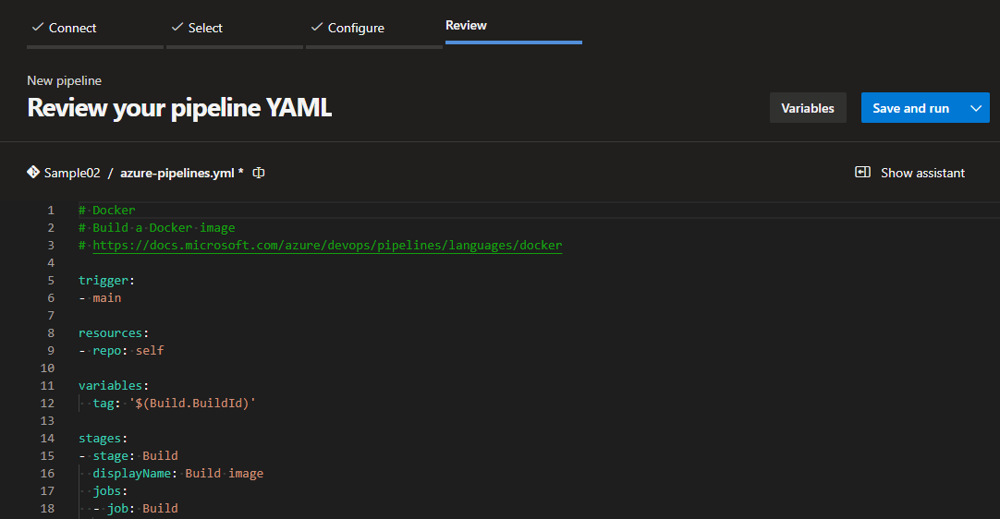

# TP 3 - Introducción a Azure DevOps

### Objetivos de Aprendizaje
 - [x] Familiarizarse con la plataforma Azure Devops 

### Consignas a desarrollar en el trabajo práctico:

 #### **¿Qué es Azure DevOps?**
  #### Breve descripción de Azure DevOps como un conjunto de herramientas para la colaboración en desarrollo de software.

  _**Azure DevOps** es una plataforma de Microsoft que facilita la colaboración en el desarrollo de software, que ofrece herramientas para la gestión de proyectos, control de versiones, integración y despliegue continuos (CI/CD), y pruebas automatizadas, permitiendo un ciclo de desarrollo ágil y eficiente._

  #### Beneficios de utilizar Azure DevOps en comparación con otras soluciones.

  _Azure DevOps ofrece varios beneficios en comparación con otras soluciones:_

  - [x] _**Integración completa:** Proporciona un conjunto completo de herramientas en una plataforma única (repositorios, CI/CD, planificación ágil, pruebas, etc.), reduciendo la necesidad de múltiples herramientas separadas._
  - [x] _**Flexibilidad:** Compatible con cualquier lenguaje, plataforma y nube, permitiendo integrarse con otras herramientas de desarrollo y flujos de trabajo._
  - [x] _**Escalabilidad:** Adecuado tanto para pequeños equipos como para grandes empresas, con capacidades de automatización y colaboración a gran escala._
  - [x] _**Colaboración:** Facilita la colaboración entre equipos distribuidos, proporcionando visibilidad en tiempo real de todo el ciclo de vida del proyecto._
  - [x] _**Integración con Microsoft:** Se integra fácilmente con productos de Microsoft como Azure, Office 365, y GitHub, optimizando el ecosistema para los equipos que ya los usan._

- **Componentes Principales de Azure DevOps**
  - **Azure Repos**
    - Sistema de control de versiones con Git o TFVC.
    - Funcionalidades clave: branching, pull requests, code reviews.
  - **Azure Pipelines**
    - CI/CD (Integración Continua y Entrega Continua).
    - Creación y gestión de pipelines para la automatización de build, test y deploy.
  - **Azure Boards**
    - Gestión de proyectos con Kanban y Scrum.
    - Seguimiento de tareas, bugs, y trabajo en curso.
  - **Azure Artifacts**
    - Gestión de paquetes (NuGet, npm, Maven).
    - Uso de feeds para compartir artefactos entre equipos.
  - **Azure Test Plans**
    - Herramientas para pruebas manuales y automatizadas.
    - Gestión de casos de prueba y reportes de calidad.
- **Integración con otras herramientas**
  - GitHub, Jenkins, Docker, Kubernetes.
- **Marketplace de extensiones**
  - Añadir funcionalidades adicionales a Azure DevOps.

## Desarrollo:
 - 3.1 Crear una cuenta en Azure DevOps

 

 - 3.2 Crear un proyecto Sample01

 
 

 - 3.3 Crear un repo GIT desde cero

 > Lo inicialicé con un archivo `README` base como se puede ver en la segunda imagen, pero sin `.gitignore`
 
 

 - 3.4 Crear un proyecto Sample02

 
 

 > **Aclaración!** En un principio, ambos proyectos los hice privados (como se ve en las imágenes), pero luego los pasé a públicos desde el _Overview_ en _Settings_. Aunque, hubo un problema con el proyecto _Sample02_ (se explica mejor en el punto _3.7_).

 - 3.5 Importar un repo desde GitHub: https://github.com/ingsoft3ucc/SimpleWebAPI.git

 
 
 

 - 3.6 Realizar un cambio en un archivo, y subirlo al repo de ADO.

 
 
 
 

 - 3.7 Crear un pipeline, solicitar acceso a jobs de paralelismo

 
 
 
 
 
 

 > Luego de correr el pipeline, me devolvió error automáticamente. Esto fue debido a que nunca se me dió ningún acceso. Por lo que solicité el mio gratuito desde el link `https://aka.ms/azpipelines-parallelism-request`. Se me dió uno privado (como muestro en el _TP4_), por lo que tuve que volver a privatizar el proyecto y dejarlo a usted como administrador para que pueda verlo tranquilamente. 
 

 - 3.8 Cambiar el tipo de proceso de Basic a Agile

 
 

 - 3.8 Crear un sprint

 
 
 

 - 3.9 Crear User Stories

 
 

 - 3.10 Crear Tasks y Bugs

 
 

> **Aclaración!** En ambos casos (_User Stories_ y _Tasks y Bugs_) me basé de ejemplos comunes encontrados en internet.

### Presentación del trabajo práctico.
Subir un al repo con las capturas de pantalla de los pasos realizados y colocar en el excel de repos (https://docs.google.com/spreadsheets/d/1mZKJ8FH390QHjwkABokh3Ys6kMOFZGzZJ3-kg5ziELc/edit?gid=0#gid=0) la url del proyecto de AzureDevops.