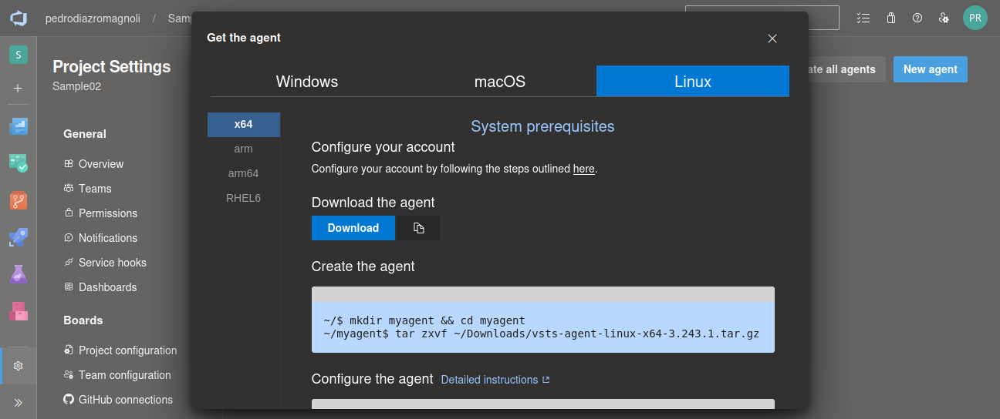

## TP 4 - Azure Devops Pipelines

### 1- Objetivos de Aprendizaje
 - Adquirir conocimientos acerca de las herramientas de integración continua presentes en ADO.
 - Configurar este tipo de herramientas.
 - Implementar procesos de construcción automatizados simples.
 
### 2- Unidad temática que incluye este trabajo práctico
Este trabajo práctico corresponde a la unidad Nº: 3 (Libro Continuous Delivery: Cap 3)

CI (Continuous Integration), Continuous Deployment y Continuous Delivery son tres prácticas clave en la ingeniería de software que se utilizan para mejorar la calidad del software y acelerar el proceso de desarrollo. Aunque están relacionadas y a menudo se utilizan juntas, tienen diferencias clave:

**Continuous Integration (CI):**

CI es una práctica que implica la integración constante de cambios de código en un repositorio compartido por parte de varios desarrolladores.
Los desarrolladores envían regularmente su código al repositorio compartido (a menudo varias veces al día).
Cada vez que se envía código, se activan pruebas automáticas para verificar la calidad y la compatibilidad del código.
El objetivo principal de CI es detectar y resolver problemas de integración de código de manera temprana y continua, lo que evita la acumulación de errores.

**Continuous Delivery** 
En Continuous Delivery, después de que el código pasa por CI y se considera estable, se automatiza el proceso de empaquetado y preparación para la entrega.
Sin embargo, la entrega real al entorno de producción se realiza manualmente después de una revisión y aprobación humanas.

**Continuous Deployment (CD)**
Se refiere a la práctica de automatizar y acelerar el proceso de entrega de software al entorno de producción.
En Continuous Development, una vez que el código pasa por el proceso de CI y se considera estable, se automatiza la entrega del software al entorno de producción sin intervención manual adicional.
Esto implica la automatización de tareas como pruebas adicionales, empaquetado, despliegue y configuración en el entorno de producción.

En resumen, CI se centra en la integración continua de cambios de código y pruebas automáticas, mientras que Continuous Delivery y Continuous Deployment se centran en la automatización del proceso de entrega de software al entorno de producción, con Continuous Delivery deteniéndose antes de la entrega real y Continuous Deployment automatizando todo el proceso hasta la entrega al entorno de producción. 
Estas prácticas son esenciales en el desarrollo de software ágil y permiten la entrega rápida y confiable de software de alta calidad.

### 3- Consignas a desarrollar en el trabajo práctico:

 **Azure DevOps Pipelines**
  - Breve descripción de Azure DevOps Pipelines.
  _Azure DevOps Pipelines es una herramienta que facilita la integración y entrega continua (CI/CD), permitiendo la automatización del proceso de compilación, pruebas y despliegue de aplicaciones en múltiples plataformas y entornos._

  - Tipos de Pipelines: Build y Deploy.
  _Los pipelines de Build se centran en la construcción y validación del código, mientras que los pipelines de Deploy se encargan de la implementación del código en varios entornos de producción o desarrollo._

  - Diferencias entre editor clásico y YAML.
  _El editor YAML permite configurar los pipelines de manera declarativa utilizando un archivo de texto, lo que facilita el seguimiento de versiones en el control de código fuente. Por otro lado, el editor clásico ofrece una interfaz gráfica para la configuración, simplificando el proceso para aquellos que prefieren una vista visual._

  - Agentes MS y Self-Hosted
  _Los agentes MS, administrados por Microsoft en la nube, proporcionan una solución gestionada para la ejecución de tareas. En contraste, los agentes Self-Hosted, gestionados directamente por el equipo de desarrollo en su propio entorno, permiten un mayor control sobre el entorno de ejecución._

### 4- Pasos del TP
 - 4.1 Verificar acceso a Pipelines concedido

 

 > Me fue concedido el acceso dias después de haberlo consultado tras el formulario del *TP N°3*.

 - 4.2 Agregar en pipeline YAML una tarea de Publish. 

  

 - 4.3 Explicar por qué es necesario contar con una tarea de Publish en un pipeline que corre en un agente de Microsoft en la nube.

 _Contar con una tarea de Publish en un pipeline que se ejecuta en un agente de Microsoft en la nube es fundamental porque garantiza que los artefactos generados se almacenen en un repositorio accesible, como el almacenamiento de artefactos de Azure DevOps. Sin esta tarea, los artefactos no se conservarían y no estarían disponibles después de la finalización del pipeline._

 - 4.4 Descargar el resultado del pipeline y correr localmente el software compilado.

  

  
 
 - 4.5 Habilitar el editor clásico de pipelines.

  

 - 4.6 Crear un nuevo pipeline con el editor clásico. Descargar el resultado del pipeline y correr localmente el software compilado.

  

 

 

  

  

 

  

 - 4.7 Configurar CI en ambos pipelines (YAML y Classic Editor). Mostrar resultados de la ejecución automática de ambos pipelines al hacer un commit en la rama main.
 > Para el Classic:
  

 > Para el YAML, busqué dentro de Settings, y tenía por default:
 
 

 - 4.8 Explicar la diferencia entre un agente MS y un agente Self-Hosted. Qué ventajas y desventajas hay entre ambos? Cuándo es conveniente y/o necesario usar un Self-Hosted Agent?

 | Característica        | Agentes MS (Microsoft)                           | Agentes Self-Hosted                           |
|-----------------------|--------------------------------------------------|-----------------------------------------------|
| **Ventajas**          | - Mantenimiento y actualización gestionados por Microsoft.   - Menor necesidad de configuración inicial.   - Escalabilidad y disponibilidad en la nube. | - Mayor control sobre el entorno y la configuración.   - Posibilidad de usar software específico o configuraciones personalizadas. |
| **Desventajas**       | - Menos control sobre el entorno de ejecución.   - Limitaciones en la personalización. | - Requieren mantenimiento y actualización manual.   - Mayor responsabilidad en la gestión del entorno. |

 _Se utiliza SH cuando se necesita un entorno específico o configuraciones personalizadas, para utilizar herramientas o software que no están disponibles en los agentes en la nube y tener control total sobre el entorno de ejecución._

 - 4.8 Crear un Pool de Agentes y un Agente Self-Hosted
 > Primero era necesario crear un Personal Access Token
 
 

 

 

 - 4.9 Instalar y correr un agente en nuestra máquina local.
 > Intenté hacerlo en Windows, pero luego de renegar un rato con el publish, probé en Linux y funcionó a la primera y a la perfección.
 
 
 
 

 - 4.10 Crear un pipeline que use el agente Self-Hosted alojado en nuestra máquina local.
 > En lugar de hacerlo desde cero, edité el de Classic Editor:
 

 - 4.11 Buscar el resultado del pipeline y correr localmente el software compilado.
 
 

 

 > Resultado:
 

 - 4.12 Crear un nuevo proyecto en ADO clonado desde un repo que contenga una aplicación en Angular como por ejemplo https://github.com/ingsoft3ucc/angular-demo-project.git

 

 

 - 4.13 Configurar un pipeline de build para un proyecto de tipo Angular como el clonado.

 

 

 

 

 

 - 4.14 Habilitar CI para el pipeline.
 > Al igual que en el punto *4.7*, se encontraba por default:  
 

 - 4.15 Hacer un cambio a un archivo del proyecto (algún cambio en el HTML que se renderiza por ejemplo) y verificar que se ejecute automáticamente el pipeline.
 > Cambié que se vea el modelo en la esquina superior derecha de la imagen:
 

 > Verificación:
 

 - 4.16 Descargar el resultado del pipeline y correr en un servidor web local el sitio construido.

 

 

 - 4.17 Mostrar el antes y el después del cambio.
 >Antes
 

 >Después
 

#### 5- Presentación del trabajo práctico.
Subir un doc al repo con las capturas de pantalla de los pasos realizados y colocar en el excel de repos (https://docs.google.com/spreadsheets/d/1mZKJ8FH390QHjwkABokh3Ys6kMOFZGzZJ3-kg5ziELc/edit?gid=0#gid=0) la url del proyecto de AzureDevops.

#### 6- Criterio de Calificación
Los pasos 4.1 al 4.11 representan un 60% de la nota total, los pasos 4.12 al 4.17 representan el 40% restante