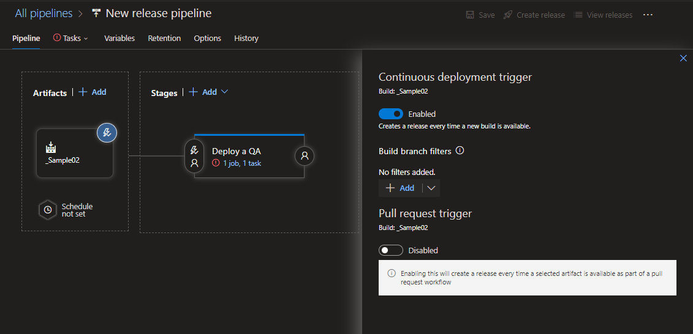
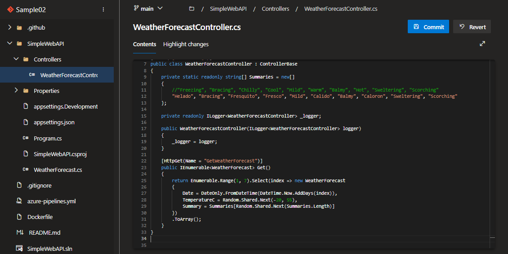
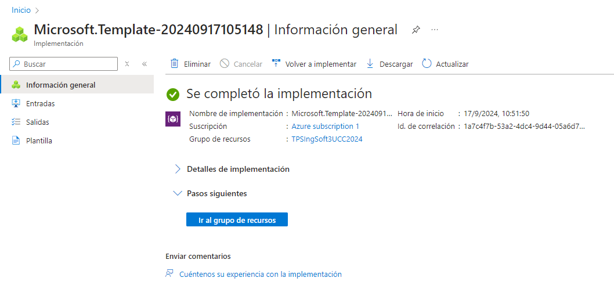
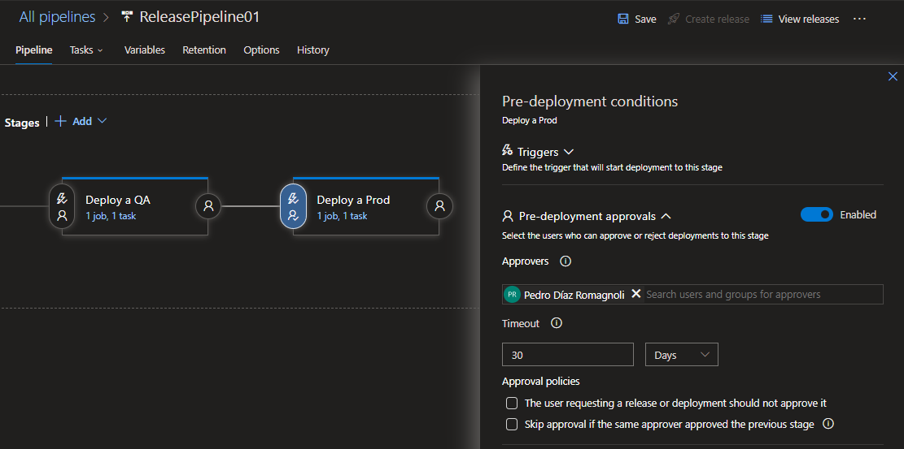

# TP 5 - Azure Devops Release Pipelines
Este trabajo práctico corresponde a la unidad Nº: 3 (Libro Continuous Delivery: Cap 10)

### Objetivos de Aprendizaje
 - [x] Adquirir conocimientos acerca de las herramientas de despliegue y releases de aplicaciones.
 - [x] Configurar este tipo de herramientas.
 - [x] Comprender el concepto de recurso en Azure
 - [x] Comprender los conceptos básicos de Release Pipelines en Azure DevOps.
 - [x] Configurar un Release Pipeline para automatizar despliegues en diferentes entornos-

### Consignas a desarrollar en el trabajo práctico:
 - Los despliegues (deployments) de aplicaciones se pueden realizar en diferentes tipos de entornos
   - On-Premise (internos) es decir en servidores propios.
   - Nubes Públicas, ejemplo AWS, Azure, Gcloud, etc.
   - Plataformas como servicios (PaaS), ejemplo Heroku, Google App Engine, AWS, Azure WebApp, etc
 - En este práctico haremos despliegue a Plataforma como Servicio utilizando Azure Web Apps

## Desarrollo:
- **4.1** Crear una cuenta en Azure

> Logrado siguiendo el instructivo correspondiente (_5.1_)


- **4.2** Crear un recurso Web App en Azure Portal y navegar a la url provista

> Logrado siguiendo el instructivo correspondiente (_5.2_)


- **4.3** Actualizar Pipeline de Build para que use tareas de DotNetCoreCLI@2 como en el pipeline clásico, luego crear un Pipeline de Release en Azure DevOps con CD habilitada

> Logrado siguiendo el instructivo correspondiente (_5.3_)





- **4.4** Optimizar Pipeline de Build

> El `yaml` que se nos pasó por **Whatsapp** hace que el pipeline del build ya esté optimizado

```bash
trigger:
- main

pool:
  vmImage: 'windows-latest'

variables:
  solution: '**/*.sln'
  buildPlatform: 'Any CPU'
  buildConfiguration: 'Release'

steps:
- task: DotNetCoreCLI@2
  displayName: 'Restaurar paquetes NuGet'
  inputs:
    command: restore
    projects: '$(solution)'

- task: DotNetCoreCLI@2
  displayName: 'Compilar la solución'
  inputs:
    command: build
    projects: '$(solution)'
    arguments: '--configuration $(buildConfiguration)'

# - task: DotNetCoreCLI@2
#   displayName: 'Ejecutar pruebas unitarias'
#   inputs:
#     command: test
#     projects: '**/*Tests/*.csproj'  # Ajusta según la ubicación de tus proyectos de prueba
#     arguments: '--configuration $(buildConfiguration)'

- task: DotNetCoreCLI@2
  displayName: 'Publicar aplicación'
  inputs:
    command: publish
    publishWebProjects: True
    arguments: '--configuration $(buildConfiguration) --output $(Build.ArtifactStagingDirectory)'
    zipAfterPublish: true

- task: PublishBuildArtifacts@1
  displayName: 'Publicar artefactos de compilación'
  inputs:
    PathtoPublish: '$(Build.ArtifactStagingDirectory)'
    ArtifactName: 'drop'
    publishLocation: 'Container'
```

- **4.5** Verificar el deploy en la url de la WebApp /weatherforecast


- **4.6** Realizar un cambio al código del controlador para que devuelva 7 pronósticos, realizar commit, evaluar ejecución de pipelines de build y release, navegar a la url de la webapp/weatherforecast y corroborar cambio




**Aclaración!**: Al hacer el _commit_, se ejecutaron automáticamente los pipelines de build y release.

- **4.7** Clonar la Web App de QA para que contar con una WebApp de PROD a partir de un Template Deployment en Azure Portal y navegar a la url provista para la WebApp de PROD.

> Logrado siguiendo el instructivo correspondiente (_5.4_), y gracias a que en el punto _4.2_ de descargué el archivo `template.zip`, con los archivos `template.json` y `parameters.json` dentro.





- **4.8** Agregar una etapa de Deploy a Prod en Azure Release Pipelines 

> Logrado siguiendo el instructivo correspondiente (_5.5_)


- **4.9**  Realizar un cambio al código del controlador para que devuelva 10 pronósticos, realizar commit, evaluar ejecución de pipelines de build y release, navegar a la url de la webapp/weatherforecast y corroborar cambio, verificar que en la url de la webapp_prod/weatherforecast se muestra lo mismo.

> Logrado siguiendo el instructivo correspondiente (_5.3_)


- **4.10** Modificar pipeline de release para colocar una aprobación manual para el paso a Producción.

> Logrado siguiendo el instructivo correspondiente (_5.6_)


- **4.11** Realizar un cambio al código del controlador para que devuelva 5 pronósticos, realizar commit, evaluar ejecución de pipelines de build y release, navegar a la url de la webapp/weatherforecast y corroborar cambio, verificar que en la url de la webapp_prod/weatherforecast aun se muestra la versión anterior.


> Aquí se puede ver la diferencia, al no haber aprobado todavía el **Deploy de Prod**


**Aclaración!**: Al hacer el _commit_, se ejecutaron automáticamente los pipelines de build y release.

- **4.12** Aprobar el pase ya sea desde el release o desde el mail recibido. 

> Aprobado desde la misma página de **Azure DevOps**


- **4.12.1** Notar que se puede dar la aprobación pero posponer su aplicación hasta una determinada fecha

> En la primera foto del punto anterior (_4.12_) se puede ver una casilla, que en caso de ser checkeada, te permite posponer la aplicación hasta cuando se desee.


- **4.13** Esperar a la finalización de la etapa de Pase a Prod y luego corroborar que en la url de la webapp_prod/weatherforecast se muestra la nueva versión coinicidente con la de QA.


- **4.14** Realizar un pipeline (no release) que incluya el deploy a QA y a PROD con una aprobación manual. El pipeline debe estar construido en YAML sin utilizar el editor clásico de pipelines ni el editor clásico de pipelines de release.

> Primero cree un _Environment_ llamado **Production** y le agregué un _check_ del tipo `Pre-Check Approvals`. Sino debería haber creado otro _stage_ intermedio para aprobar el **Deploy de Prod**.


> El paso siguiente fue crear el pipeline no release para que se ejecute como aquel que hicimos en los puntos anteriores. 


> Lo corrimos para ver si funcionaba, pero no hicimos ninguna modificación. Aceptamos los permisos que se utilice la conexión al service existente.


> Fue exitoso


> Ahora aplicamos un cambio. En mi caso, modifiqué para que aparezcan siete pronósticos.


> Se corrió automáticamente el pipeline y se pausó esperando la aprobación previo al **Deploy de Prod**


> Fue exitoso


###  Presentación del trabajo práctico.
- Subir un doc al repo con las capturas de pantalla de los pasos realizados y tener en el excel de repos (https://docs.google.com/spreadsheets/d/1mZKJ8FH390QHjwkABokh3Ys6kMOFZGzZJ3-kg5ziELc/edit?gid=0#gid=0) la url del proyecto de AzureDevops.
- Aclarar los nombres de los pipelines que se deben evaluar.

###  Criterio de Calificación
Los pasos 4.1 al 4.13 representan un 60% de la nota total, los pasos 4.13 y subsiguientes representan el 40% restante.
