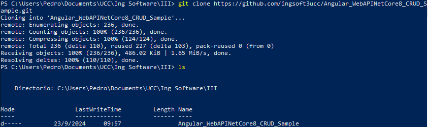
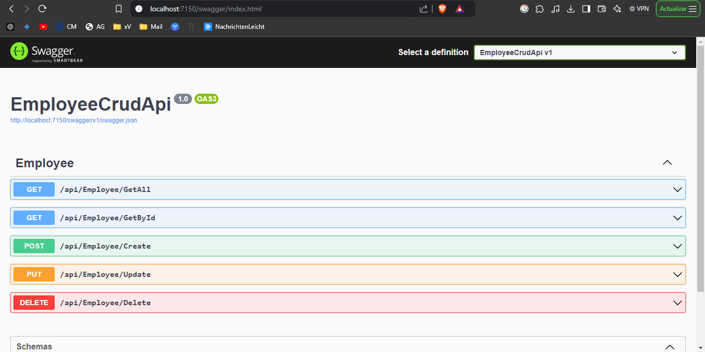

# TP 6 - Pruebas Unitarias
Este trabajo práctico corresponde a la unidad Nº: 5 (Libro Ingeniería de Software: Cap 8)

### Objetivos de Aprendizaje
 - [x] Adquirir conocimientos sobre conceptos referidos a pruebas unitarias (unit tests).
 - [x] Generar y ejecutar pruebas unitarias utilizando frameworks disponibles.

#### Prerequisitos:
 - [x] Node.js
 - [x] Angular CLI
 - [x] .NET Core 8 SDK

 

## Desarrollo:

- **4.1** Creación de una BD SQL Server para nuestra App
 A\. Crear una BD Azure SQL Database (Ver Instructivo 5.1) o montar una imagen Docker de SQL Server como se solicitó en el punto 12 del [TP02].

 > Yo seguí la opción número uno, y gracias al instructivo _5.1_:
 
  

 > Donde ejecuté el siguiente código en la Base de Datos SQL creada en _Azure_:
  ```sql

  SET ANSI_NULLS ON
  GO
  SET QUOTED_IDENTIFIER ON
  GO
  CREATE TABLE [dbo].[Employees](
    [Id] [int] IDENTITY(1,1) NOT NULL,
    [Name] [nvarchar](max) NULL,
    [CreatedDate] [datetime2](7) NOT NULL,
  CONSTRAINT [PK_Employees] PRIMARY KEY CLUSTERED 
  (
    [Id] ASC
  )WITH (STATISTICS_NORECOMPUTE = OFF, IGNORE_DUP_KEY = OFF, OPTIMIZE_FOR_SEQUENTIAL_KEY = OFF) ON [PRIMARY]
  ) ON [PRIMARY] TEXTIMAGE_ON [PRIMARY]
  GO
  SET IDENTITY_INSERT [dbo].[Employees] ON 
  GO
  INSERT [dbo].[Employees] ([Id], [Name], [CreatedDate]) VALUES (1, N'Juan Perez', CAST(N'2024-09-05T00:00:00.0000000' AS DateTime2))
  GO
  INSERT [dbo].[Employees] ([Id], [Name], [CreatedDate]) VALUES (2, N'Carla Ruiz', CAST(N'2024-09-05T22:22:47.4405720' AS DateTime2))
  GO
  INSERT [dbo].[Employees] ([Id], [Name], [CreatedDate]) VALUES (3, N'Carlos Gomez', CAST(N'2024-09-06T09:16:50.0709430' AS DateTime2))
  GO
  INSERT [dbo].[Employees] ([Id], [Name], [CreatedDate]) VALUES (4, N'Joaquin Zarate', CAST(N'2024-09-06T09:19:37.8987160' AS DateTime2))
  GO
  INSERT [dbo].[Employees] ([Id], [Name], [CreatedDate]) VALUES (5, N'Luis Rodriguez', CAST(N'2024-09-06T09:23:31.3244340' AS DateTime2))
  GO
  SET IDENTITY_INSERT [dbo].[Employees] OFF
  GO

  ```


- **4.2** Obtener nuestra App
A\. Clonar el repo https://github.com/ingsoft3ucc/Angular_WebAPINetCore8_CRUD_Sample.git

 

B\. Seguir las instrucciones del README.md del repo clonado prestando atención a la modificación de la cadena de conexión en el appSettings.json para que apunte a la BD creada en 4.1 

 
 

C\. Navegar a http://localhost:7150/swagger/index.html:

 

- Probar uno de los controladores para verificar el correcto funcionamiento de la API.

 > En mi caso, probé el controlador `/GetAll` 
 

D\. Navegar a http://localhost:4200 y verificar el correcto funcionamiento de nuestro front-end Angular

 


- **4.3** Crear Pruebas Unitarias para nuestra API
A\. En el directorio raiz de nuestro repo crear un nuevo proyecto de pruebas unitarias para nuestra API 
```bash
dotnet new xunit -n EmployeeCrudApi.Tests
```
 

B\. Instalar dependencias necesarias

Primero, instala las siguientes bibliotecas mediante NuGet:
- [x] **Moq**
- [x] **xUnit** 
- [x] **Microsoft.EntityFrameworkCore.InMemory**

 

C\. Editar archivo UnitTest1.cs reemplazando su contenido

 

D\. Renombrar archivo UnitTest1.cs por EmployeeControllerUnitTests.cs

 

E\. Editar el archivo EmployeeCrudApi.Tests/EmployeeCrudApi.Tests.csproj para agregar una referencia a nuestro proyecto de EmployeeCrudApi reemplazando su contenido

 

F\. Ejecutar los siguientes comandos para ejecutar nuestras pruebas
```bash
dotnet build
dotnet test
```
G\. Verificar que se hayan ejecutado correctamente las pruebas

 

H\. Verificar que no estamos usando una dependencia externa como la base de datos.

I\. Modificar la cadena de conexión en el archivo appsettings.json para que use un usuario o password incorrecto y recompilar el proyecto EmployeeCrudApi

 
 

J\. Verificar que nuestro proyecto ya no tiene acceso a la BD navegando a http://localhost:7150/swagger/index.html y probando uno de los controladores:

 > Volvemos a probar el controlador `/GetAll`, y vemos el error _500_
 

K\. En la carpeta de nuestro proyecto EmployeeCrudApi.Tests volver a correr las pruebas
```bash
dotnet build
dotnet test
```
L\. Verificar que se hayan ejecutado correctamente las pruebas inclusive sin tener acceso a la BD, lo que confirma que es efectivamente un conjunto de pruebas unitarias que no requieren de una dependencia externa para funcionar.

 

M\. Modificar la cadena de conexión en el archivo appsettings.json para que use el usuario y password correcto y recompilar el proyecto EmployeeCrudApi

 
 

N\. Verificar que nuestro proyecto vuelve a tener acceso a la BD navegando a http://localhost:7150/swagger/index.html y probando uno de los controladores:

 > Volvemos a probar el controlador `/GetAll`, y vemos que esta vez nos tiró un _200: Successful_
 


- **4.4** Creamos pruebas unitarias para nuestro front de Angular:

A\. Nos posicionamos en nuestro proyecto de front, en el directorio EmployeeCrudAngular/src/app

 

B\. Editamos el archivo app.component.spec.ts reemplazando su contenido

 

C\. Creamos el archivo employee.service.spec.ts reemplazando su contenido

 

D\. Editamos el archivo employee.component.spec.ts ubicado en la carpeta **employee** reemplazando su contenido

 

E\. Editamos el archivo addemployee.component.spec.ts ubicado en la carpeta **addemployee** reemplazando su contenido

 

F\. En el directorio raiz de nuestro proyecto EmployeeCrudAngular ejecutamos el comando `ng test`

G\. Vemos que se abre una ventana de Karma con Jasmine en la que nos indica que los tests se ejecutaron correctamente

 

H\. Vemos que los tests se ejecutaron correctamente:

 

I\. Verificamos que no esté corriendo nuestra API navegando a http://localhost:7150/swagger/index.html y recibiendo esta salida:

 

J\. Los puntos G y H nos indican que se han ejecutado correctamente las pruebas inclusive sin tener acceso a la API, lo que confirma que es efectivamente un conjunto de pruebas unitarias que no requieres de una dependencia externa para funcionar.

- **4.5** Agregamos generación de reporte XML de nuestras pruebas de front.
> Para cuando integremos nuestras pruebas en un pipeline de Build, vamos a necesitar el resultado devuelto por nuestras pruebas para reportarlas junto a las pruebas de back que se reportan automaticamente. 

A\. Instalamos dependencia karma-junit-reporter

 

B\. En el directorio raiz de nuestro proyecto (al mismo nivel que el archivo angular.json) creamos un archivo karma.conf.js con el siguiente contenido

 

C\. Ejecutamos nuestros test de la siguiente manera:

> Lo tuve que hacer ejecutando _PowerShell_ como **administrador** porque de no ser así, no funcionaba
 

D\. Verificamos que se creo un archivo test-result.xml en el directorio test-results que está al mismo nivel que el directorio src

 


- **4.6** Modificamos el código de nuestra API y creamos nuevas pruebas unitarias:

A\. Realizar al menos 5 de las siguientes modificaciones sugeridas al código de la API:

 - [x] Al agregar y al editar un empleado, controlar que el nombre del empleado no esté repetido.
 - [x] Verificar que el nombre no contenga números
 - [x] Asegurar que el nombre del empleado no contenga caracteres especiales, a menos que sea necesario (por ejemplo, caracteres especiales en apellidos como "O'Connor" o "García").
 - [x] Implementar un filtro para evitar el uso de palabras inapropiadas, ofensivas o que puedan violar políticas internas. (Que también se puede usar para Prohibir el uso de nombres triviales o genéricos como "Empleado", "N/A", "Nombre", etc.)
 - [x] Verificar que no haya palabras vacías o que el nombre no esté compuesto solo de espacios.

> Así modifiqué el archivo `EmployeeController.cs` del directorio `EmployeeCrudApi\Controllers`:
```bash
using EmployeeCrudApi.Data;
using System.ComponentModel.DataAnnotations;
using System.Text.RegularExpressions;
using EmployeeCrudApi.Models;
using Microsoft.AspNetCore.Mvc;
using Microsoft.EntityFrameworkCore;
using System;
using System.Collections.Generic;
using System.Linq;
using System.Threading.Tasks;

namespace EmployeeCrudApi.Controllers
{
    [Route("api/[controller]/[action]")]
    [ApiController]
    public class EmployeeController : ControllerBase
    {
        private ApplicationDbContext _context;
        private readonly List<string> inappropriateWords = new List<string> { "palabron", "palabrota" }; // Agrega aquí palabras inapropiadas

        public EmployeeController(ApplicationDbContext context)
        {
            _context = context;
        }

        [HttpGet]
        public async Task<List<Employee>> GetAll()
        {
            return await _context.Employees.ToListAsync();
        }

        [HttpGet]
        public async Task<Employee> GetById(int id)
        {
            return await _context.Employees.FindAsync(id);
        }

        [HttpPost]
        public async Task<IActionResult> Create([FromBody] Employee employee)
        {
            //1. Verificar que el nombre no esté repetido
            if (await _context.Employees.AnyAsync(e => e.Name == employee.Name))
            {
                return BadRequest(new { status = 400, error = "Bad Request", message = "El nombre del empleado ya existe." });
            }

            //2.  Validar que el nombre no contenga números
            if (Regex.IsMatch(employee.Name, @"\d"))
            {
                return BadRequest("El nombre no debe contener números.");
            }

            //3. Validar que el nombre no contenga caracteres especiales
            if (!Regex.IsMatch(employee.Name, @"^[a-zA-Z\s'áéíóúÁÉÍÓÚñÑ]+$"))
            {
                return BadRequest(new { status = 400, error = "Bad Request", message = "El nombre contiene caracteres inválidos." });
            }

            //4. Filtro de palabras inapropiadas
            foreach (var word in inappropriateWords)
            {
                if (employee.Name.Contains(word, StringComparison.OrdinalIgnoreCase))
                {
                    return BadRequest(new { status = 400, error = "Bad Request", message = "El nombre contiene palabras inapropiadas." });
                }
            }

            //5. Verificar que el nombre no esté vacío o solo compuesto de espacios
            if (string.IsNullOrWhiteSpace(employee.Name))
            {
                return BadRequest("El nombre no puede estar vacío o compuesto solo de espacios.");
            }

            // Configurar la fecha de creación
            employee.CreatedDate = DateTime.Now;

            // Guardar el empleado en la base de datos
            await _context.Employees.AddAsync(employee);
            await _context.SaveChangesAsync();

            return Ok(employee);
        }

        [HttpPut]
        public async Task Update([FromBody] Employee employee)
        {
            Employee employeeToUpdate = await _context.Employees.FindAsync(employee.Id);
            employeeToUpdate.Name = employee.Name;
            await _context.SaveChangesAsync();
        }

        [HttpDelete]
        public async Task Delete(int id)
        {
            var employeeToDelete = await _context.Employees.FindAsync(id);
            _context.Remove(employeeToDelete);
            await _context.SaveChangesAsync();
        }
    }
}
```

B\. Crear las pruebas unitarias necesarias para validar las modificaciones realizadas en el código

> Así modifiqué el archivo `EmployeeControllerUnitTests.cs` del directorio `EmployeeCrudApi.Tests`:
```bash
using EmployeeCrudApi.Controllers;
using EmployeeCrudApi.Data;
using EmployeeCrudApi.Models;
using Microsoft.EntityFrameworkCore;
using Microsoft.AspNetCore.Mvc;
using System;
using System.Collections.Generic;
using System.Threading.Tasks;
using Xunit;

namespace EmployeeCrudApi.Tests
{
    public class EmployeeControllerTests
    {
        private ApplicationDbContext GetInMemoryDbContext()
        {
            var options = new DbContextOptionsBuilder<ApplicationDbContext>()
                .UseInMemoryDatabase(databaseName: Guid.NewGuid().ToString()) // Crear una nueva base de datos en memoria para cada prueba
                .Options;

            return new ApplicationDbContext(options);
        }

        [Fact]
        public async Task GetAll_ReturnsListOfEmployees()
        {
            // Arrange
            var context = GetInMemoryDbContext();
            context.Employees.AddRange(
                new Employee { Id = 1, Name = "John Doe" },
                new Employee { Id = 2, Name = "Jane Doe" }
            );
            context.SaveChanges();

            var controller = new EmployeeController(context);

            // Act
            var result = await controller.GetAll();

            // Assert
            Assert.Equal(2, result.Count);
            Assert.Equal("John Doe", result[0].Name);
            Assert.Equal("Jane Doe", result[1].Name);
        }

        [Fact]
        public async Task GetById_ReturnsEmployeeById()
        {
            // Arrange
            var context = GetInMemoryDbContext();
            context.Employees.Add(new Employee { Id = 1, Name = "John Doe" });
            context.SaveChanges();

            var controller = new EmployeeController(context);

            // Act
            var result = await controller.GetById(1);

            // Assert
            Assert.NotNull(result);
            Assert.Equal(1, result.Id);
            Assert.Equal("John Doe", result.Name);
        }

        [Fact]
        public async Task Create_AddsEmployee()
        {
            // Arrange
            var context = GetInMemoryDbContext();
            var controller = new EmployeeController(context);

            var newEmployee = new Employee { Id = 3, Name = "New Employee" };

            // Act
            await controller.Create(newEmployee);

            // Assert
            var employee = await context.Employees.FindAsync(3);
            Assert.NotNull(employee);
            Assert.Equal("New Employee", employee.Name);
        }
        
        // Pruebas adicionales:

        // 1. Prueba para nombres repetidos
        [Fact]
        public async Task Create_ShouldReturnBadRequest_WhenNameIsDuplicated()
        {
            var context = GetInMemoryDbContext();
            context.Employees.Add(new Employee { Id = 1, Name = "Juan Carlos" });
            context.SaveChanges();

            var controller = new EmployeeController(context);
            var newEmployee = new Employee { Id = 2, Name = "Juan Carlos" };

            var result = await controller.Create(newEmployee);

            Assert.IsType<BadRequestObjectResult>(result);
        }

        // 2. Prueba para números
        [Fact]
        public async Task Create_ReturnsBadRequest_ForNameWithNumbers()
        {
            // Arrange
            var context = GetInMemoryDbContext();
            var controller = new EmployeeController(context);

            var newEmployee = new Employee { Id = 6, Name = "John123"};

            // Act
            var result = await controller.Create(newEmployee);

            // Assert
            Assert.IsType<BadRequestObjectResult>(result);
        }

        // 3. Prueba para caracteres no permitidos
        [Fact]
        public async Task Create_ShouldReturnBadRequest_WhenNameHasInvalidCharacters()
        {
            var context = GetInMemoryDbContext();
            var controller = new EmployeeController(context);
            var newEmployee = new Employee { Id = 4, Name = "Juan#%" };

            var result = await controller.Create(newEmployee);

            Assert.IsType<BadRequestObjectResult>(result);
        }

        // 4. Prueba para palabras inapropiadas
        [Fact]
        public async Task Create_ShouldReturnBadRequest_WhenNameContainsInappropriateWords()
        {
            var context = GetInMemoryDbContext();
            var controller = new EmployeeController(context);
            var newEmployee = new Employee { Id = 6, Name = "palabrota" };

            var result = await controller.Create(newEmployee);

            Assert.IsType<BadRequestObjectResult>(result);
        }

        // 5. Prueba para nombres vacíos o con espacios
        [Fact]
        public async Task Create_ShouldReturnBadRequest_WhenNameIsEmptyOrWhiteSpace()
        {
            var context = GetInMemoryDbContext();
            var controller = new EmployeeController(context);
            var newEmployee = new Employee { Id = 5, Name = "   " };

            var result = await controller.Create(newEmployee);

            Assert.IsType<BadRequestObjectResult>(result);
        }

        [Fact]
        public async Task Update_UpdatesEmployee()
        {
            // Arrange
            var context = GetInMemoryDbContext();
            var existingEmployee = new Employee { Id = 1, Name = "Old Name" };
            context.Employees.Add(existingEmployee);
            context.SaveChanges();

            var controller = new EmployeeController(context);

            var updatedEmployee = new Employee { Id = 1, Name = "Updated Name" };

            // Act
            await controller.Update(updatedEmployee);

            // Assert
            var employee = await context.Employees.FindAsync(1);
            Assert.NotNull(employee);
            Assert.Equal("Updated Name", employee.Name);
        }

        [Fact]
        public async Task Delete_RemovesEmployee()
        {
            // Arrange
            var context = GetInMemoryDbContext();
            var employeeToDelete = new Employee { Id = 1, Name = "John Doe" };
            context.Employees.Add(employeeToDelete);
            context.SaveChanges();

            var controller = new EmployeeController(context);

            // Act
            await controller.Delete(1);

            // Assert
            var employee = await context.Employees.FindAsync(1);
            Assert.Null(employee); // Verifica que el empleado fue eliminado
        }

    }
}
```

> Me corrió a la perfección:
 


- **4.7** Modificamos el código de nuestro Front y creamos nuevas pruebas unitarias:

A\. Realizar en el código del front las mismas modificaciones hechas a la API. 

> Descargué la librería Toast con algunas animaciones de angular:
 

> Agregué los _imports_ y _estilos_ necesarios para que todo funcione correctamente en los archivos `app.config.ts` y `styles.css`
 

> Por último, modifiqué el archivo `addemployee.components.ts`, agregando las verificaciones:
```bash
import { Component, OnInit } from '@angular/core';
import { Employee } from '../employee.model';
import { EmployeeService } from '../employee.service';
import { Router, ActivatedRoute } from '@angular/router';
import { CommonModule } from '@angular/common';
import { FormsModule } from '@angular/forms';
import { ToastrService } from 'ngx-toastr';

@Component({
  selector: 'app-addemployee',
  standalone: true,
  imports: [CommonModule, FormsModule],
  templateUrl: './addemployee.component.html',
  styleUrls: ['./addemployee.component.css']
})
export class AddemployeeComponent implements OnInit {
  newEmployee: Employee = new Employee(0, '', '');
  submitBtnText: string = "Create";
  imgLoadingDisplay: string = 'none';
  inappropriateWords: string[] = ['palabron', 'palabrota']; // Agrega aquí las palabras inapropiadas

  constructor(private employeeService: EmployeeService,
              private router: Router,
              private activatedRoute: ActivatedRoute,
              private toastr: ToastrService) {
  }

  ngOnInit(): void {
    this.activatedRoute.queryParams.subscribe(params => {
      const employeeId = params['id'];
      if (employeeId)
        this.editEmployee(employeeId);
    });
  }

  addEmployee(employee: Employee) {
    // 1: Verificar que el nombre no esté vacío o compuesto solo de espacios
    if (!employee.name.trim()) {
      this.toastr.error('El nombre no puede estar vacío o compuesto solo de espacios.');
      return;
    }
    // 2: Validar que el nombre no contenga números
    const regex = /\d/;
    if (regex.test(employee.name)) {
      this.toastr.error('El nombre no puede contener números.');
      return;
    }
    // 3: Validar que el nombre no contenga caracteres especiales
    const nameRegex = /^[a-zA-Z\s'áéíóúÁÉÍÓÚñÑ]+$/; //'
    if (!nameRegex.test(employee.name)) {
      this.toastr.error('El nombre no puede contener caracteres especiales.');
      return;
    }
    // 4: Filtro de palabras inapropiadas
    for (const word of this.inappropriateWords) {
      if (employee.name.toLowerCase().includes(word.toLowerCase())) {
        this.toastr.error("El nombre contiene palabras inapropiadas.");
        return;
      }
    }

    // 5: Verificar que el nombre no esté repetido
    employee.createdDate = new Date().toISOString();
    this.employeeService.createEmployee(employee).subscribe({
      next: result => {
        this.router.navigate(['/']);
      },
      error: err => {
        if (err.status === 400 && err.error.message === 'El nombre del empleado ya existe.') {
          this.toastr.error(err.error.message);
        } else {
          this.toastr.error('Ocurrió un error al crear el empleado.');
        }
      }
    });

    this.submitBtnText = "";
    this.imgLoadingDisplay = 'inline';
  }

  editEmployee(employeeId: number) {
    this.employeeService.getEmployeeById(employeeId).subscribe(res => {
      this.newEmployee.id = res.id;
      this.newEmployee.name = res.name;
      this.submitBtnText = "Edit";
    });
  }
}
```

B\. Las validaciones deben ser realizadas en el front sin llegar a la API, y deben ser mostradas en un toast:

 
 
 
 
 

C\. Crear las pruebas unitarias necesarias en el front para validar las modificaciones realizadas en el código del front.

> Modifiqué el archivo `addemployee.component.spec.ts`, agregando las pruebas unitarias:
```bash
import { TestBed, ComponentFixture } from '@angular/core/testing';
import { AddemployeeComponent } from './addemployee.component';
import { HttpClientTestingModule } from '@angular/common/http/testing';
import { ActivatedRoute } from '@angular/router';
import { of, throwError } from 'rxjs'; // para simular observables y errores
import { DatePipe } from '@angular/common';
import { ToastrService } from 'ngx-toastr';
import { EmployeeService } from '../employee.service'; // Asegúrate de importar EmployeeService
import { HttpErrorResponse } from '@angular/common/http';
import { Employee } from '../employee.model'; // Importa el modelo Employee

describe('AddemployeeComponent', () => {
  let component: AddemployeeComponent;
  let fixture: ComponentFixture<AddemployeeComponent>;
  let toastrService: jasmine.SpyObj<ToastrService>;
  let employeeService: jasmine.SpyObj<EmployeeService>;

  beforeEach(() => {
    const toastrSpy = jasmine.createSpyObj('ToastrService', ['error']);
    const employeeServiceSpy = jasmine.createSpyObj('EmployeeService', ['createEmployee']); // Mock del servicio

    TestBed.configureTestingModule({
      imports: [HttpClientTestingModule, AddemployeeComponent], // Importa el componente standalone aquí
      providers: [
        DatePipe,
        {
          provide: ActivatedRoute,
          useValue: {
            queryParams: of({ id: 1 }) // simula el parámetro id en la URL
          }
        },
        { provide: ToastrService, useValue: toastrSpy },
        { provide: EmployeeService, useValue: employeeServiceSpy } // Proporciona el mock del servicio
      ]
    });

    fixture = TestBed.createComponent(AddemployeeComponent);
    component = fixture.componentInstance;
    toastrService = TestBed.inject(ToastrService) as jasmine.SpyObj<ToastrService>;
    employeeService = TestBed.inject(EmployeeService) as jasmine.SpyObj<EmployeeService>;
  });

  it('should create', () => {
    expect(component).toBeTruthy();
  });

  it('should display error if name is just spaces', () => {
    component.newEmployee.name = '    ';
    component.addEmployee(component.newEmployee);
    expect(toastrService.error).toHaveBeenCalledWith('El nombre no puede estar vacío o compuesto solo de espacios.');
  });

  it('should display error if name contains numbers', () => {
    component.newEmployee.name = 'John1 Doe';
    component.addEmployee(component.newEmployee);
    expect(toastrService.error).toHaveBeenCalledWith('El nombre no puede contener números.');
  });

  it('should display error if name contains symbols', () => {
    component.newEmployee.name = 'John% Doe';
    component.addEmployee(component.newEmployee);
    expect(toastrService.error).toHaveBeenCalledWith('El nombre no puede contener caracteres especiales.');
  });

  it('should display error if name contains inappropriate words', () => {
    component.newEmployee.name = 'John palabrota';
    component.addEmployee(component.newEmployee);
    expect(toastrService.error).toHaveBeenCalledWith('El nombre contiene palabras inapropiadas.');
  });

  // 1. Test para nombres duplicados
  it('should display error if name is duplicated', () => {
    // Crea una instancia de Employee con parámetros correctos
    const duplicatedEmployee = new Employee(0, 'Juan Carlos', new Date().toISOString());

    // Simular que el servicio devuelve un error de duplicado (400 Bad Request)
    const errorResponse = new HttpErrorResponse({
      error: { message: 'El nombre del empleado ya existe.' },
      status: 400
    });

    employeeService.createEmployee.and.returnValue(throwError(() => errorResponse));

    component.newEmployee = duplicatedEmployee;
    component.addEmployee(component.newEmployee);

    expect(employeeService.createEmployee).toHaveBeenCalledWith(duplicatedEmployee);
    expect(toastrService.error).toHaveBeenCalledWith('El nombre del empleado ya existe.');
  });

  it('should create employee if name is valid and not duplicated', () => {
    const validEmployee = new Employee(0, 'John Doe', new Date().toISOString());

    // Simular que el servicio devuelve una respuesta exitosa
    employeeService.createEmployee.and.returnValue(of(validEmployee));

    component.newEmployee = validEmployee;
    component.addEmployee(validEmployee);

    expect(employeeService.createEmployee).toHaveBeenCalledWith(validEmployee);
    expect(toastrService.error).not.toHaveBeenCalled();
  });

  it('should load employee for editing if id is present in query params', () => {
    spyOn(component, 'editEmployee');
    component.ngOnInit();
    expect(component.editEmployee).toHaveBeenCalledWith(1);
  });

  it('should call EmployeeService.createEmployee when adding a valid employee', () => {
    const validEmployee = new Employee(0, 'John Doe', new Date().toISOString());
    employeeService.createEmployee.and.returnValue(of(validEmployee));
    component.newEmployee = validEmployee;

    component.addEmployee(validEmployee);

    expect(employeeService.createEmployee).toHaveBeenCalledWith(validEmployee);
  });
});
```

> Por último las corrí todas correctamente con el comando `ng test`:
 

###  Presentación del trabajo práctico.
- Subir un doc al repo con las capturas de pantalla de los pasos realizados
- Subir el proyecto a un repo para poder evaluar, revisar y ejecutar el código y las pruebas unitarias. ([Github del Proyecto](Angular_WebAPINetCore8_CRUD_Sample).)

###  Criterio de Calificación
Los pasos 4.1 al 4.5 representan un 60% de la nota total, los pasos 4.6 y subsiguientes representan el 40% restante.