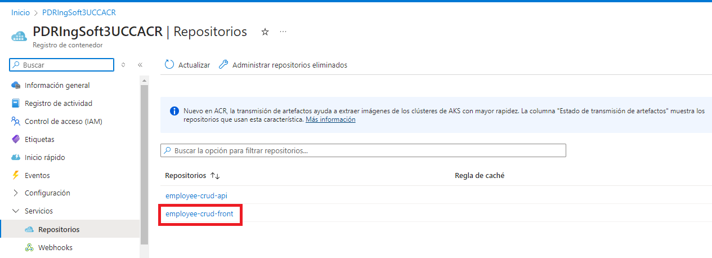
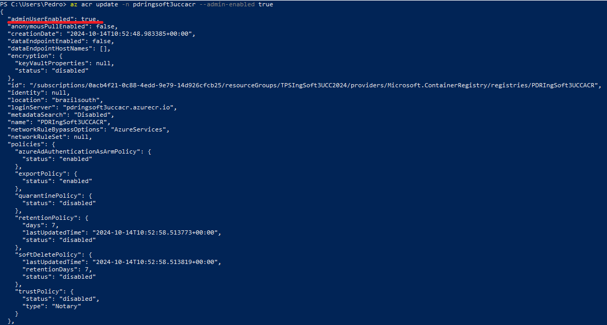
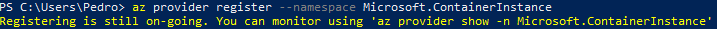
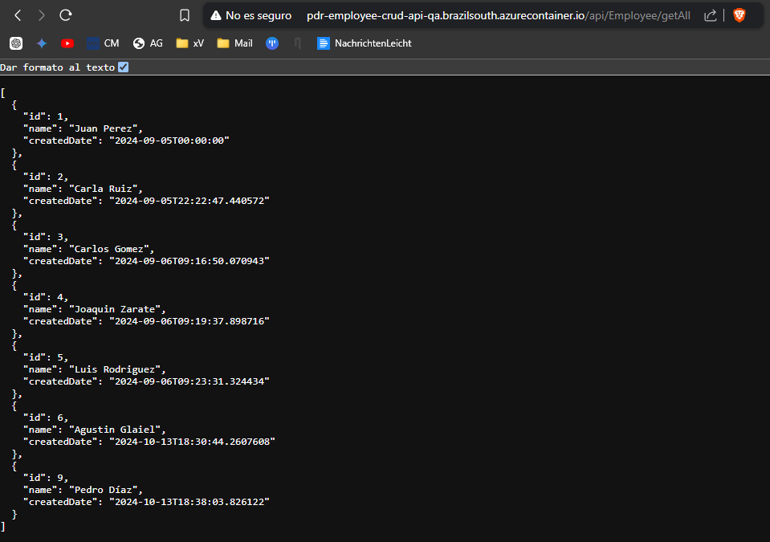

# TP 8 - Implementación de Contenedores en Azure y Automatización con Azure CLI
Este trabajo práctico corresponde a la unidad Nº: 2 (Libro Ingeniería de Software: Unidad 18)

### Objetivos de Aprendizaje
Al finalizar esta sesión, los estudiantes serán capaces de:

- [x] **Seleccionar el servicio de contenedores más adecuado para diferentes escenarios de despliegue en la nube.**
- [x] **Configurar y utilizar Azure Container Registry (ACR) para almacenar imágenes Docker de manera segura.**
- [x] **Automatizar la creación y gestión de recursos en Azure mediante scripts y comandos de Azure CLI.**
- [x] **Utilizar variables y secretos de manera eficiente y segura en los pipelines de Azure DevOps.**
- [x] **Desarrollar y ejecutar un pipeline CI/CD completo que incluya la construcción y despliegue de contenedores en Azure.**

### Desarrollo:
#### Prerequisitos:
 - Azure CLI instalado

 	

- **4.1** Modificar nuestro pipeline para construir imágenes Docker de back y front y subirlas a ACR
- Desarrollo del punto 4.1: 
	- **4.1.1** Crear archivos DockerFile para nuestros proyectos de Back y Front
   	  - En la raiz de nuestro repo crear una carpeta docker con dos subcarpetas api y front, dentro de cada una de ellas colocar los dockerfiles correspondientes para la creación de imágenes docker en función de la salida de nuestra etapa de Build y Test
        
		

	  > **Atención!** En la línea 7, cambié el `COPY ./api/ ./` por `COPY ./EmployeeCrudApi/ ./`

   	- **4.1.2** Crear un recurso ACR en Azure Portal siguiendo el instructivo 5.1

		
		
		


  	- **4.1.3** Modificar nuestro pipeline en la etapa de Build y Test
   	  - Luego de la tarea de publicación de los artefactos de Back agregar la tarea de publicación de nuestro dockerfile de back para que esté disponible en etapas posteriores:

	  	

   	  - Luego de la tarea de publicación de los artefactos de Front agregar la tarea de publicación de nuestro dockerfile de front para que esté disponible en etapas posteriores:

	  	
 
  	- **4.1.4** En caso de no contar en nuestro proyecto con una ServiceConnection a Azure Portal para el manejo de recursos, agregar una service connection a Azure Resource Manager como se indica en instructivo 5.2 

		

  	- **4.1.5** Agregar a nuestro pipeline variables 
		
		
  	
	- **4.1.6** Agregar a nuestro pipeline una nueva etapa que dependa de nuestra etapa de Build y Test
  	  - Agregar tareas para generar imagen Docker de Back
   	  
   	  	
  	
  	- **4.1.7** Ejecutar el pipeline y en Azure Portal acceder a la opción Repositorios de nuestro recurso Azure Container Registry. 

  		

		- Verificar que exista una imagen con el nombre especificado en la variable backImageName asignada en nuestro pipeline
	  		

	  - **4.1.8** Agregar tareas para generar imagen Docker de Front (DESAFIO)
  	  	- A la etapa creada en 4.1.6 Agregar tareas para generar imagen Docker de Front

			

		> También se agregó una variable de `frontImageName: 'employee-crud-front'` debajo de la ya existente del back.

		> Lo ejecutamos y verificamos que existe la imagen con el nombre especificado:{}
			
			
  	
	- **4.1.9** Agregar a nuestro pipeline una nueva etapa que dependa de nuestra etapa de Construcción de Imagenes Docker y subida a ACR
	  - Agregar variables a nuestro pipeline:
		
		
  	  
	  - Agregar variable secreta cnn-string-qa desde la GUI de ADO que apunte a nuestra BD de SQL Server de QA como se indica en el instructivo 5.3
	  	
		
  	    
  	  - Agregar tareas para crear un recurso Azure Container Instances que levante un contenedor con nuestra imagen de back
			
	  	

		Antes de correr el pipeline, hay que cambiar primeramente esta parte del Program.cs:
			```cs
			builder.Services.AddDbContext<ApplicationDbContext>(options => options.UseSqlServer(
			builder.Configuration.GetConnectionString("DefaultConnection")));
			```
		Por:
			
		
		> Esto es debido a que en la primera versión siempre usa la cadena de conexión **DefaultConnection** desde el archivo de configuración `appsettings.json`. Ahora intenta obtener primero la cadena de conexión desde la variable de entorno `cnn_string_qa`.

		Además, hay que setear en **true** el acceso administrativo de nuestro container registry y activar un servicio en Azure llamado Microsoft.ContainerInstance, para poder usar contenedores en la nube de Azure.
			
			

  	  - **4.1.10** Ejecutar el pipeline

	  	
	  
	  En Azure Portal acceder al recurso de Azure Container Instances creado.
	  
		

	  Copiar la url del contenedor y navegarlo desde browser. Verificar que traiga datos.
  	  
		> Le agregué a la url copiada los bash `/api/Employee/getAll`
	  		
	  
	  - **4.1.11** Agregar tareas para generar un recurso Azure Container Instances que levante un contenedor con nuestra imagen de front (DESAFIO)
  	  	- A la etapa creada en 4.1.9 Agregar tareas para generar contenedor en ACI con nuestra imagen de Front
  	        
			- Tener en cuenta que el contenedor debe recibir como variable de entorno API_URL el valor de una variable container-url-api-qa definida en nuestro pipeline. Para que funcione, el código fuente del front debe ser modificado para que la url de la API pueda ser cambiada luego de haber sido construída la imagen. 

				> Basándome en el repo https://github.com/ingsoft3ucc/CrudAngularConEnvironment.git, modifiqué los siguientes archivos en las líneas marcadas:
					
					
					
				
				> Y creo los siguientes archivos en las carpetas:
					`/EmployeeCrudAngular/src/app`
					
					`/EmployeeCrudAngular/src`
					
				
				> Ahora sí agrego la variable **API_URL**
					

				> Luego escribimos las variables de entorno
					

				> Para así poder agregar la etapa con las correctas tareas para levantar el nuevo container
					

				> Vemos que se haya creado la instancia del contenedor y que esté todo en orden
					

				> Copiamos la url del contenedor y lo navegamos desde browser y verificamos que efectivamente trae el front.
					

  	  - **4.1.12** Agregar tareas para correr pruebas de integración en el entorno de QA de Back y Front creado en ACI.
			

		> Antes de correr el pipeline, borré los test de prueba que hicimos en el **TP7** (`primer_test` y `addEmployee_test`). Además, modifiqué los test restantes para que tomen el nuevo **baseUrl**:
			

		> Borré la carpeta **results** dentro del directorio **cypress** para que no traiga el historial de los test:
			 
		 
#### 4.2 Desafíos:
- [x] **4.2.1** Agregar tareas para generar imagen Docker de Front. (Punto 4.1.8)
- [x] **4.2.2** Agregar tareas para generar en Azure Container Instances un contenedor de imagen Docker de Front. (Punto 4.1.11)
- [x] **4.2.3** Agregar tareas para correr pruebas de integración en el entorno de QA de Back y Front creado en ACI. (Punto 4.1.12)
- **4.2.4** Agregar etapa que dependa de la etapa de Deploy en ACI QA y genere contenedores en ACI para entorno de PROD.
	
	> Primero hay que crear el entorno de producción y agregamos un check de nuestro usuario para dar el OK del deploy.
		
	
	> Agregamos las variables externas correspondientes
		

	> Y las variables de entorno
		

	> Para ahora sí, poder agregar el código	
			
		
	
	> Una vez ejecutado, nos va a pedir la aprobación anteriormente asignada
		
	
	> Y comprobamos que todo se haya creado y funcione correctamente
		


### Presentación del trabajo práctico.
- Subir un doc al repo de GitHub con las capturas de pantalla de los pasos realizados. Debe ser un documento (md, word, o pdf), no videos. Y el documento debe seguir los pasos indicados en el Desarrollo del TP.
- Acceso al [repo de Azure DevOps](https://dev.azure.com/pedrodiazromagnoli/Angular_WebAPINetCore8_CRUD_Sample) para revisar el trabajo realizado.

### Criterio de Calificación
El paso 4.1 representan un 30% de la nota total, el paso 4.2 representa el 70% restante.
