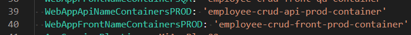
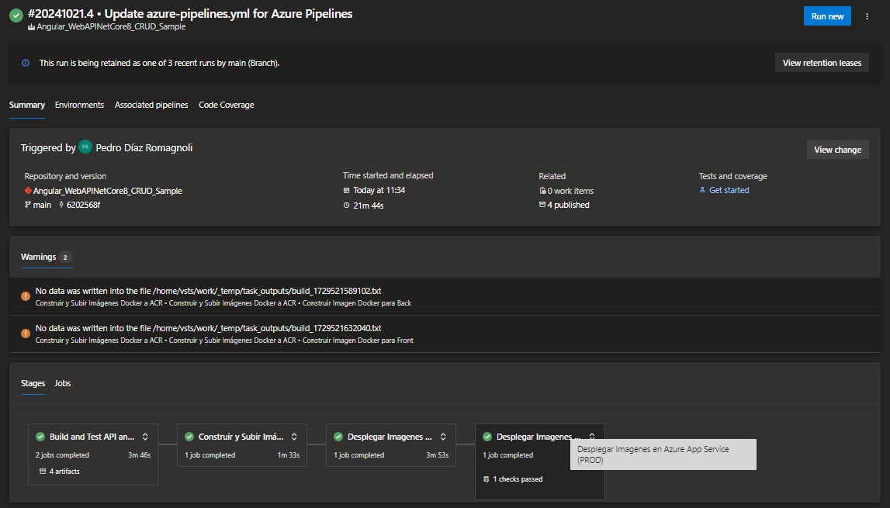

# TP 9 - Implementación de Contenedores en Azure Parte 2
Este trabajo práctico corresponde a la unidad Nº: 2 (Libro Ingeniería de Software: Unidad 18)

### Objetivos de Aprendizaje
Al finalizar esta sesión, los estudiantes serán capaces de:

- [x] 1. **Seleccionar el servicio de contenedores más adecuado para diferentes escenarios de despliegue en la nube.**
- [x] 2. **Configurar y utilizar Azure Container Registry (ACR) para almacenar imágenes Docker de manera segura.**
- [x] 3. **Automatizar la creación y gestión de recursos en Azure mediante scripts y comandos de Azure CLI.**
- [x] 4. **Utilizar variables y secretos de manera eficiente y segura en los pipelines de Azure DevOps.**
- [x] 5. **Desarrollar y ejecutar un pipeline CI/CD completo que incluya la construcción y despliegue de contenedores en Azure.**

### Desarrollo:

- **4.1** Modificar nuestro pipeline para incluir el deploy en QA y PROD de Imagenes Docker en Servicio Azure App Services con Soporte para Contenedores
- Desarrollo del punto 4.1: 
	
  	- **4.1.1** Agregar a nuestro pipeline una nueva etapa que dependa de nuestra etapa de Construcción y Pruebas y de la etapa de Construcción de Imagenes Docker y subida a ACR realizada en el TP08
  	    
  	  - Agregar tareas para crear un recurso Azure Container Instances que levante un contenedor con nuestra imagen de back utilizando un AppServicePlan en Linux
  	  
	  > Primero debemos crear un Plan de App Service gratuito
	  	

	  > Una vez creado, procedemos a agregar las variables de entorno necesarias para la App Service y el código proporcionado
	  	
		

		

	  > Una vez corrido el pipeline, nos fijamos en la sección de Aplicaciones de **MiAppPlan02** que **employee-crud-api-qa-container** se haya creado correctamente.
	  	

	  > Buscamos el dominio seleccionando esta Aplicación Web y le agregamos `/api/Employee/getAll`
	  	
			
  	     
#### 4.2 Desafíos:
- **4.2.1** Agregar tareas para generar Front en Azure App Service con Soporte para Contenedores
	
	> Primero debemos agregar la variable de entorno correspondiente
		

	> Una vez agregada, procedemos a agregar las tasks necesarias para generar el Front
		
	
	> Corre correctamente:
		

	> Una vez corrido el pipeline, nos fijamos en la sección de Aplicaciones de **MiAppPlan02** que **employee-crud-front-qa-container** se haya creado correctamente.
		

	> Buscamos el dominio seleccionando esta Aplicación Web y nos fijamos que efectivamente traiga la vista con los datos:
		
		

- **4.2.2** Agregar variables necesarias para el funcionamiento de la nueva etapa considerando que debe haber 2 entornos QA y PROD para Back y Front.

	> Serían las mismas que el trabajo práctico pasado (**TP8**) con la leve modificación de que debemos poner ahora las dominios de nuestros WebApp API (de QA y de PROD respectivamente con el `/api/Employee/getAll`):
		
	
- **4.2.3** Agregar tareas para correr pruebas de integración en el entorno de QA de Back y Front creado en Azure App Services con Soporte para Contenedores. 

	> Este es el código de mi stage que corre las pruebas de integración en QA:
		

	> Vemos que se corrieron todas las pruebas correctamente (enrealidad son 25 test, como dice en la primera fila del sumario, pero aparece ese numero por los test ejecutados anteriormente):
		

- **4.2.4** Agregar etapa que dependa de la etapa de Deploy en QA que genere un entorno de PROD.

	> Primero hay que crear las variables de entorno.
		
	
	> Para ahora sí, poder agregar el código
		
		

	> Una vez ejecutado, nos va a pedir la aprobación anteriormente asignada	
			
		
	
	> Y comprobamos que todo se haya creado y funcione correctamente
		
		

- **4.2.5** Entregar un pipeline que incluya:
  - **A)** Etapa Construcción y Pruebas Unitarias y Code Coverage Back y Front
  - **B)** Construcción de Imágenes Docker y subida a ACR
  - **C)** Deploy Back y Front en QA con pruebas de integración para Azure Web Apps
  - **D)** Deploy Back y Front en QA con pruebas de integración para ACI
  - **E)** Deploy Back y Front en QA con pruebas de integración para Azure Web Apps con Soporte para contenedores
  - **F)** Aprobación manual de QA para los puntos C,D,E
  - **G)** Deploy Back y Front en PROD para Azure Web Apps
  - **H)** Deploy Back y Front en PROD para ACI
  - **I)** Deploy Back y Front en PROD para Azure Web Apps con Soporte para contenedores

### Presentación del trabajo práctico.
- Subir un doc al repo de GitHub con las capturas de pantalla de los pasos realizados. Debe ser un documento (md, word, o pdf), no videos. Y el documento debe seguir los pasos indicados en el Desarrollo del TP.
- Acceso al [repo de Azure DevOps](https://dev.azure.com/pedrodiazromagnoli/Angular_WebAPINetCore8_CRUD_Sample) para revisar el trabajo realizado.

### Criterio de Calificación
El paso 4.1 representa un 20% de la nota total, el paso 4.2 representa el 80% restante.